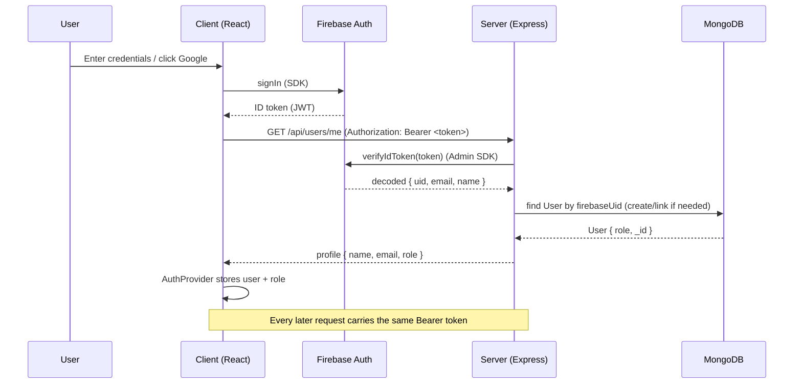

# Authentication Flow

## Overview

Inkspire delegates **identity** to Firebase Authentication and keeps
**authorization** (the user's role) in MongoDB.

- The client signs users in with the Firebase SDK (Email/Password or Google).
- Firebase issues a short-lived **ID token** (JWT).
- The client sends that token as a `Bearer` header on every API request.
- The backend verifies the token with the Firebase Admin SDK, then looks up (or
  creates) a matching `User` document in MongoDB to resolve the user's role.

## Frontend Flow

1. The user signs in via `authService` (`loginWithEmailPassword`,
   `signInWithGoogle`, or `registerWithEmailPassword`).
2. `AuthProvider` subscribes to Firebase auth state. When a user is present, it
   calls `GET /api/users/me` to fetch the MongoDB profile and learn the `role`.
3. The shared Axios instance attaches the current user's Firebase ID token as an
   `Authorization: Bearer <token>` header on every outgoing request.

## Backend Flow

1. `verifyFirebaseToken` middleware reads the `Authorization` header. If it is
   missing or not a `Bearer` token, it responds `401`. If the Firebase Admin
   SDK is not configured, it responds `503`.
2. It calls `resolveUserFromAuthHeader`, which:
   - calls `admin.auth().verifyIdToken(idToken)` to validate the token;
   - finds the `User` by `firebaseUid`;
   - if none exists but the decoded email matches an existing account with no
     `firebaseUid`, links that account to the Firebase UID;
   - otherwise creates a new `User` with `role: 'user'`;
   - returns an `AuthUser`, or `null` if the token is missing/invalid.
3. The resolved user is attached to `req.user` and the request continues.

### `req.user` Shape

```ts
{
  uid: string;        // Firebase UID
  mongoId: ObjectId;  // MongoDB _id of the User document
  email: string;
  name: string;
  role: 'user' | 'admin';
}
```

## Role-Based Access

- **user** — the default role assigned on first sign-in. Can place orders,
  review books, and manage their own profile.
- **admin** — can manage the catalog, review/approve book requests, and view
  analytics. `requireAdmin` runs after `verifyFirebaseToken` and responds `403`
  if `req.user.role !== 'admin'`. The admin router applies both guards to every
  route it mounts.

On the client, `ProtectedRoute` gates authenticated pages and `AdminRoute`
gates admin pages based on the `role` loaded by `AuthProvider`.

## Optional Authentication

Some endpoints serve both anonymous and logged-in visitors (e.g. listing books,
recommendations, creating reservations, submitting book requests). These use
`attachUserIfPresent`, which resolves `req.user` when a valid token is present
but never blocks the request when it is absent. This lets the backend
personalize results or attribute actions to a user without requiring login.

## Sequence Diagram


