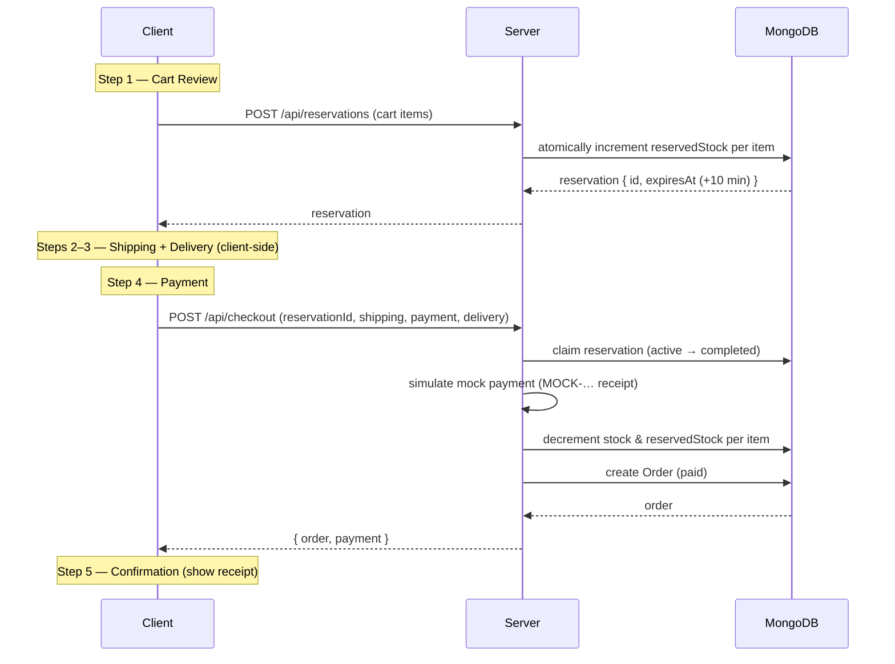

# Checkout Flow

## Overview

Checkout is a five-step wizard (`apps/client/src/pages/Checkout.tsx`) driven by
a reducer:

1. **Cart Review** — confirm items and reserve stock
2. **Shipping** — enter shipping information
3. **Delivery** — choose a delivery method
4. **Payment** — mock payment and order creation
5. **Confirmation** — show the receipt

A 10-minute inventory reservation backs the whole flow so stock cannot be
oversold while the user is checking out. See
[`reservation-flow.md`](reservation-flow.md) for the reservation internals.

## Steps

### Step 1 — Cart Review

The client posts the cart to `POST /api/reservations`. The server atomically
reserves stock for each item and returns a reservation with an `expiresAt`
timestamp 10 minutes in the future. If any item is out of stock, the request
fails and no stock is held.

### Step 2 — Shipping Information

The user enters `fullName`, `email`, `address`, `city`, `postal`, and
`country`. All are required; the server re-validates them at checkout.

### Step 3 — Delivery Method

The user selects one of:

- `standard`
- `express`
- `pickup` (in-store collection)

### Step 4 — Payment (mock)

The client posts to `POST /api/checkout` with the `reservationId`,
`shippingInfo`, `paymentMethod` (`card` | `paypal` | `cod`), and
`deliveryMethod`. The server:

1. Re-checks the reservation belongs to the user and is still `active`
   (expiring it if its timer has passed).
2. Inside `withOptionalTransaction`, atomically claims the reservation
   (`status: 'active' → 'completed'`).
3. Simulates a payment — it returns a mock receipt with a
   `MOCK-…` transaction id. **No real provider is contacted and no card data is
   ever accepted or stored.**
4. Decrements `stock` and `reservedStock` for each item.
5. Creates the `Order` with `paymentStatus: 'paid'` and `status: 'Paid'`.

### Step 5 — Confirmation

The client shows the order summary, totals, transaction id, and delivery
estimate returned by the server.

## Reservation Timer

The UI shows a countdown (`ReservationTimer`) based on the reservation's
`expiresAt`. The reservation window is **10 minutes**
(`RESERVATION_DURATION_MS = 10 * 60 * 1000`).

## On Expiry

A background cleanup job runs **every 30 seconds**
(`startReservationCleanupJob`), marking expired `active` reservations as
`expired` and releasing their held `reservedStock`. A reservation is also
expired on demand if it is read or checked out after its timer has passed. Once
expired, checkout returns `410` and the user must return to the cart and
re-reserve.

## Shipping Cost Logic

Computed by `getShippingPrice(deliveryMethod, itemsPrice)`
(`apps/server/src/config/shipping.ts`, mirrored on the client):

| Delivery method | Cost                                                    |
| --------------- | ------------------------------------------------------- |
| `standard`      | Free if `itemsPrice ≥ $50`, otherwise `$4.99`           |
| `express`       | `$14.99`                                                |
| `pickup`        | Free                                                    |

`totalPrice = itemsPrice + shippingPrice`.

## Sequence Diagram

